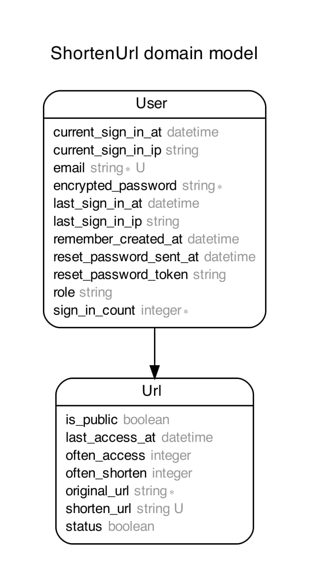
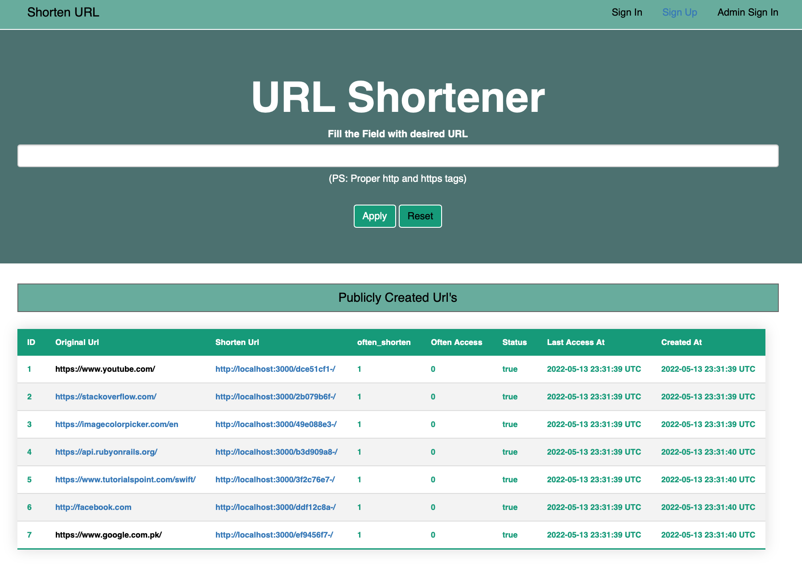
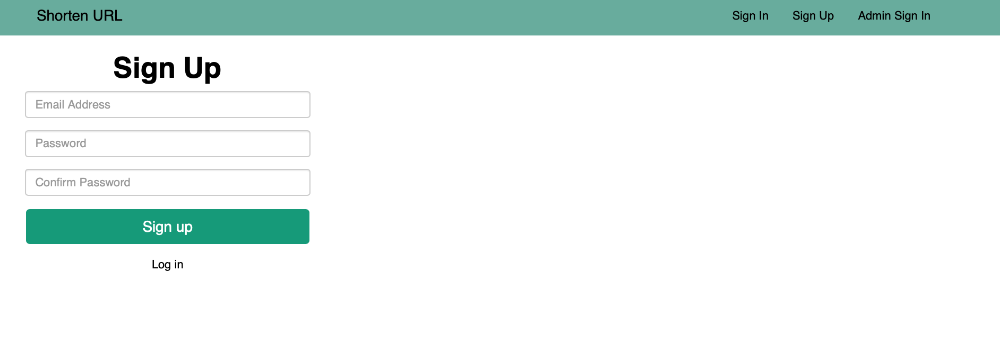
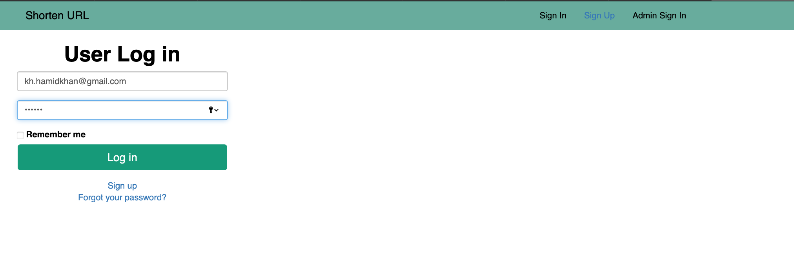
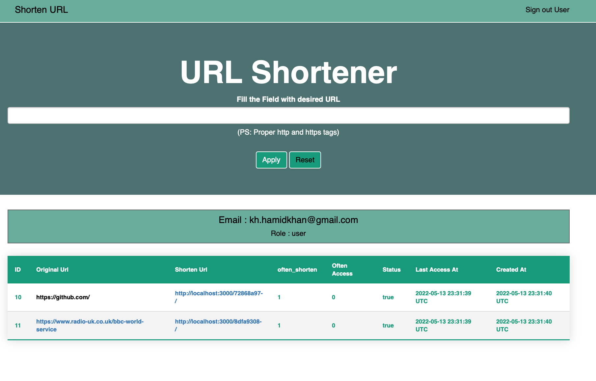
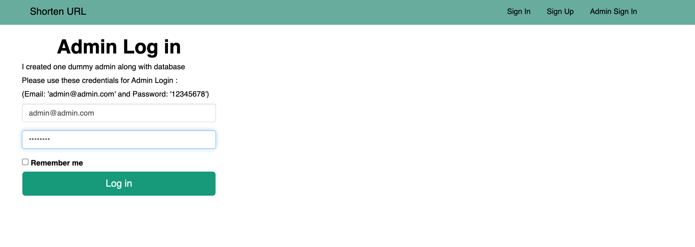
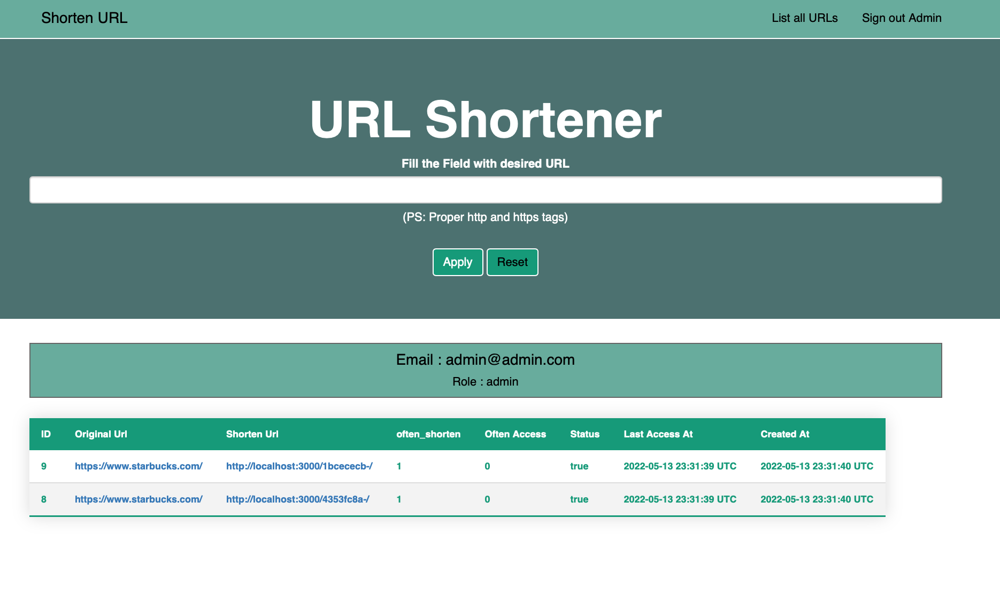
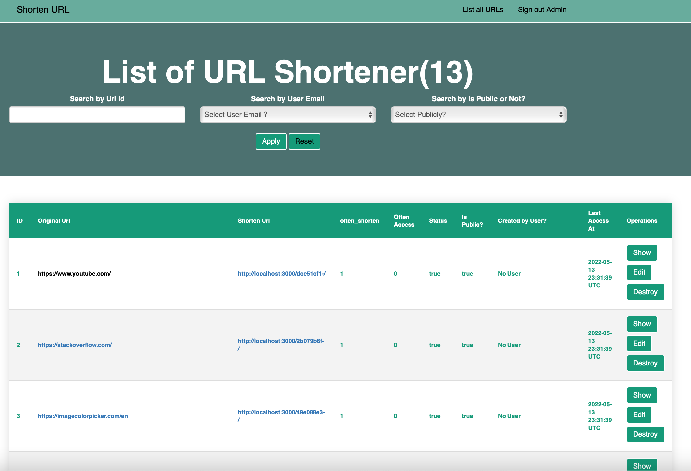
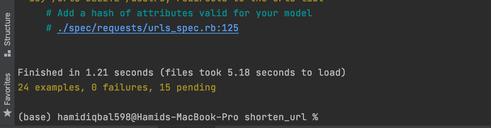
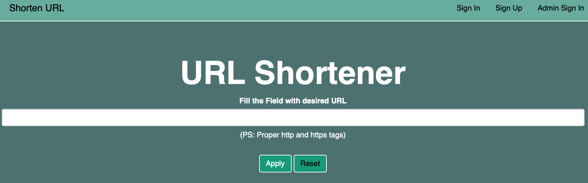

# Learning Assessment
## Shorten URL

The aim is to express my level of skills and knowledge as they are required to deal with everyday tasks as a Full Stakc Developer.
To achieve this purpose, I completed all tasks while keeping in mind the task definition.

Solution:
* I used Ruby on Rails Framework for Development.
  (Reason to choose this framework bcz it's a monolithic application which provide my complete backend and frontend within the same application.)
* Ruby (Version: 2.7.1)
    * CMD (bundle install)
* Rails (Version: 6.1.5)
* Database - PostgreSQL
* Application is exposed using Dockerization container on Web
* Database creation
* Database initialization
    * CMD (rake db:setup)
    * I added initial records in db:seed

* For Test Cases I used (Rspec)
* How to run the test suite
    * CMD (bundle exec rspec spec)

* Running instructions:
    * CMD (rails s)
    * View on any Web Using any Agent (eg: Chrome)
    * Type: localhost:3000/

## Run the Rails Application using Docker Container

host: localhost -> host: database

##### Please run these commands to complete setup:

```
docker compose build
docker-compose run web rake db:create
docker-compose run --rm web bundle exec rake db:migrate
docker-compose run --rm web bundle exec rake db:seed
docker compose up
```
*PS: If you're using MAC then it cause an issue in "apt-get update" cmd in Docker, the solution to this problem is going to "Screen Time" setting and change the settings to "Unrestricted web access".

##### If you wish to run without docker
##### Then just uncomment 3 lines in database.yml
##### Which includes host, username, and password.


## Overview

Here Applications has two models according to the following database scheme.
* Url belongs_to user. (Main model where we've the major functionality. Above user it depends the url created publicly or specific user oriented.)
* User (Used for authentication purpose. User has email and password with the specific role either Admin or User.)




1. `http://localhost:3000` Landing Page.
    ```
   - Here we have the list of created Publicly Created Shorten Url's
   - In the below table you can see the Original Url, Shorten Url, How Often is it created, How Often is it accessed,
        Status, Last Accessed Time as well.
   - Then in the right above corner we've the User Signup, SignIn, and Admin SignIn.
   - While in the middle you can add new Url's which you want to shorten (If Urls is already exist the it will just increase the often_shorten)
    ```
   


2. `http://localhost:3000/users/sign_up` User Sign Up Page.
    ```
    - Here we can enter the User New Credentials to Sign Up.
    - For Example I Created User with following Credentials:
        Email: kh.hamidkhan@gmail.com
        Password: 123456
    ```
   


3. `http://localhost:3000/users/sign_in` User Sign In Page.
    ```
    - Here we can enter the User Credentials to log In and View user oriented Shorten Url's.
    - Login Credentials I entered:
        Email: kh.hamidkhan@gmail.com
        Password: 123456
    ```
   


4. `http://localhost:3000` User Specific Landing Page.
    ```
    - Here we can see the Shorten Url's created by this specific user.
    - These Shorten Url's are not publicly available to other or guest users.
    - Furthermore, he can add further Shorten Url's as well.
    ```
   


5. `http://localhost:3000/users/sign_in?role=admin` Admin Sign In Page.
    ```
    - Here we can enter the Admin Credentials to log In and View and perfrom action on Shorten Url's.
    - I Created on Admin which has all access in this Application 
    - Here are the Login Credentials I created:
        Email: admin@admin.com
        Password: 12345678
    ```
   


6. `http://localhost:3000` Admin Specific Landing Page.
    ```
    - Here we can see the Shorten Url's created by this admin.
    - These Shorten Url's are not publicly available to other users or admins.
    - Furthermore, he can add further Shorten Url's as well.
    - Most important Functionality admin have on the top right corner is listing all Shorten Url's.
    ```
   


7. `http://localhost:3000/urls` Listing all Shorten Url's.
    ```
    - Here we've the list of all shorten Urls created by publicly or specifc user.
    - Admin can apply these 3 filters on Index page of Shorten Url's.
        Filter by Shorten Url Id.
        Filter by User Email.
        Filter by check Publicly or Not (Means is this shorten url created by any specific user or not)
    - Admin can perform complete CRUD operation on the Shorten Url's.
        Like Admin can edit specific shorten Url. 
        Admin can delete the specific shorten Url.
        Admin can view the specific shorten Url.
    ```
   

### IN Total 24 Test Cases are implemented.

    - For Unit Test Cases I used Rspec Library.




### Landing Page of Shorten URL Product




## That's ALL, Folks!

###

##### *** In case something isn't clear or any issue while setup, feel free to contact me. Email Address: hamidiqbal598@gmail.com

## GOOD BYE

